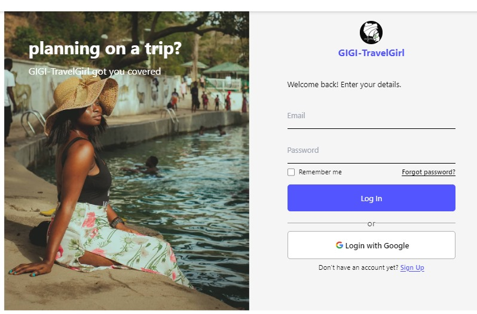

# GIGI TravelGirl: Travel and Tourism Website.

## Your Goto Girl for anything Travel and Tourism.

Demo 

## Welcome.

Welcome to GIGI TravelGirl, your travel and tourism platform designed for travellers, explorer and tourist seeking ultimate travelling experience, adventures and exploration, Whether you're embarking on an adventure or you want to explore a new country GIGI-TravelGirl is here to elevates your travels😉.

## Table of Contents

- [GIGI TravelGirl: Travel and Tourism Website.](#gigi-travelgirl-travel-and-tourism-website)
  - [Your Goto Girl for anything Travel and Tourism.](#your-goto-girl-for-anything-travel-and-tourism)
  - [Welcome.](#welcome)
  - [Table of Contents](#table-of-contents)
- [About GIGI-TravelGirl.](#about-gigi-travelgirl)
  - [Team and Roles](#team-and-roles)
  - [Technologies](#technologies)
- [Front-End](#front-end)
- [Back-End](#back-end)
  - [Version Control and Collaboration](#version-control-and-collaboration)
  - [Installation](#installation)
- [Features](#features)
  - [Contributing](#contributing)
  - [License](#license)
  - [Contact Us](#contact-us)

# About GIGI-TravelGirl.

GIGI-TravelGirl offers a seamless, flexible, and user-friendly interface for travel and tourism. This README file includes all of the features, guides, insights, technologies and how you can contribute to
making GIGI-TravelGirl better.

## Team and Roles

**Adeosun Oluwaseyi(Back-end Developer)**
**Role**: Back-end Developer focuses on Backend.
**Contributions**:

- Setup Database and configuration of the database using express and mongodb.
- Creation of some of the data models like user, review, bookhotel e.t.c using mongoose.
- Implementation of different functionalities like Sign-in/Google Sign-in Authentication, diffrent functionality routes, forgetpassword functionality, email authentication etc.
- Backend development using nodejs, mongoose and mongodb
- Integration of Stripe as payment processing.
- Contributed to the API and backend design.
  Contributed to the data model and database architecture.

**Osi Kemebradikumo(Front-End Dveloper)**
**Role**: Front-End Dveloper focuses on the front-end.
**Contributions:**

- Design and creation of an engaging user-friendly-interface.
- Utilised React and vit for the front-end
- Contributed to the overall design and visual appeal of the platform.
- Created the logo, selected colors, and designed some pages.
- Development of the user profile and dashboard, prioritizing user experience.
- Implementation of profile settings for enhanced user customization.

**Kumdan Nandom Job(FullStack Developer)**
**Role**: FullStack Developer focused on the backend and front-end.
**Contributions:**

- Contributed to the data models, database architecture and API functionalities.
- Responsible for the connectivity of both the backend and front-end using axios.
- Contributed to the flight booking page .......
- Implementation of Redis integration for Storing session data in Redis allows for fast read and write operations.
- Responsible for flight, location and its API routes respectively.

## Technologies

# Front-End

- React.js: A JavaScript library for interacting and building user interfaces.
- Vite.js: A fast, modern frontend build tools.
- Axios: A promise-based HTTP client for the browser and server side(Nodejs).
- Slider: A modern slider used for creating interactive and responsive carousels.
- AOS: A JavaScript library that allows animation elements on webpage.

# Back-End

- Node.js: A JavaScript runtime environment that allows developers to build server-side and network-side applications.
- Mongoose: A Object Data Model(ODM) library for MongoDB and Node.js.
- Express: A JavaScript framework for web applications and APIs.
- JWT & Passport: JWT (JSON Web Tokens) and Passport are both authentication mechanisms.
- Google Oauth: Integration for authentication using Google accounts.
- Nodemailer: A module for Nodejs applications to send and receive mails.
- Stripe: A payment gateway for online transactions.
- MongoDB: A NoSQL database that is open source. It use for developing scalable applications with evolving data schemas.
- axios: A promise-based HTTP client for the browser and server side(Nodejs).
- Bcrypt: A cryptographic hashing library used for securely hashing passwords.

## Version Control and Collaboration

- GIT: Distributed version control system.
- GITHUB: Web-based platform for version control and collaboration.

## Installation

Follow these steps to setup GIGI-TravelGirl locally on your server. For developers interested in contributing to the project or exploring the codebase, follow these steps:

<!-- Add a button or any element you want to trigger the copy action -->

<button id="copyButton">Copy Text</button>

<!-- Add the text you want to copy -->

  This is the text that will be copied.

1. Clone the repository: `git clone [repository-url]`
   - Open the terminal and run:
   - []
2. Install dependencies: `npm install`
3. Set up environment variables: Create a `.env` file and configure necessary environment variables.
4. Run the development server: `npm run dev`

# Features

Our Travel and Tourism Application offers a range of features to cater to the diverse needs of travelers:

1. **Discover Destinations**: Explore a wide range of destinations around the world, including popular tourist spots, hidden gems, and off-the-beaten-path locations. Browse through curated lists, articles, and guides to find inspiration for your next adventure.

2. **Plan Your Trip**: Use our trip planning tools to create personalized itineraries, set travel dates, and budget your expenses. Access detailed information about attractions, landmarks, accommodations, and activities to make informed decisions.

3. **Book Accommodations**: Search and book accommodations such as hotels, resorts, vacation rentals, and hostels directly through our website. Filter options based on location, price, amenities, and user reviews to find the perfect place to stay.

4. **Discover Activities**: Browse through a diverse selection of activities and experiences available at your chosen destination. Whether you're interested in sightseeing tours, outdoor adventures, cultural experiences, or culinary delights, you'll find something to suit your interests.

5. **Connect with Locals**: Engage with local guides, tour operators, and travel enthusiasts to gain insider tips, recommendations, and firsthand insights into your destination. Connect with fellow travelers to share experiences and create memorable moments together.

6. **User Profiles**: Create a personalized user profile to save favorite destinations, track past trips, and share travel experiences with others. Customize your profile settings and preferences to enhance your browsing and booking experience.

## Contributing

We welcome contributions from the community to help improve and enhance our Travel and Tourism Application. Whether you're a developer, designer, or travel enthusiast, there are many ways to contribute:

- Report bugs and suggest enhancements by opening an issue.
- Submit pull requests for fixes, features, or documentation improvements.
- Share feedback and ideas for new features or improvements.

Please review our [Contribution Guidelines](./CONTRIBUTING.md) for more information on how to contribute.

## License

GIGI TravelGirl is licensed under the [MIT License](./LICENSE).

## Contact Us

If you have any questions, feedback, or inquiries about our Travel and Tourism Application, please don't hesitate to contact us at [doe70097@gmail.com]. We're here to help and make your travel experience memorable!

Happy travels! 🌍✈️
